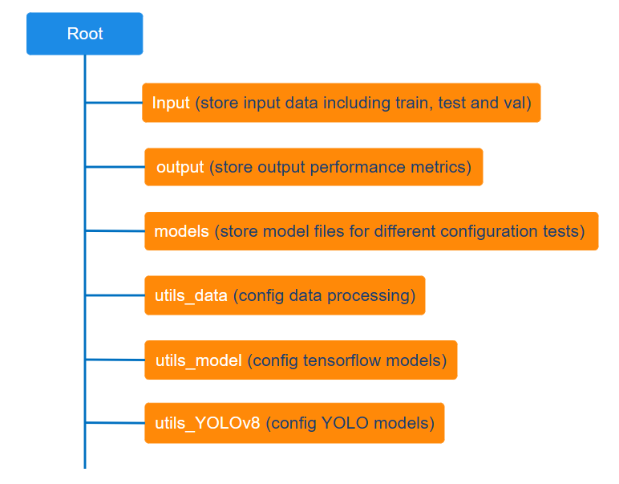
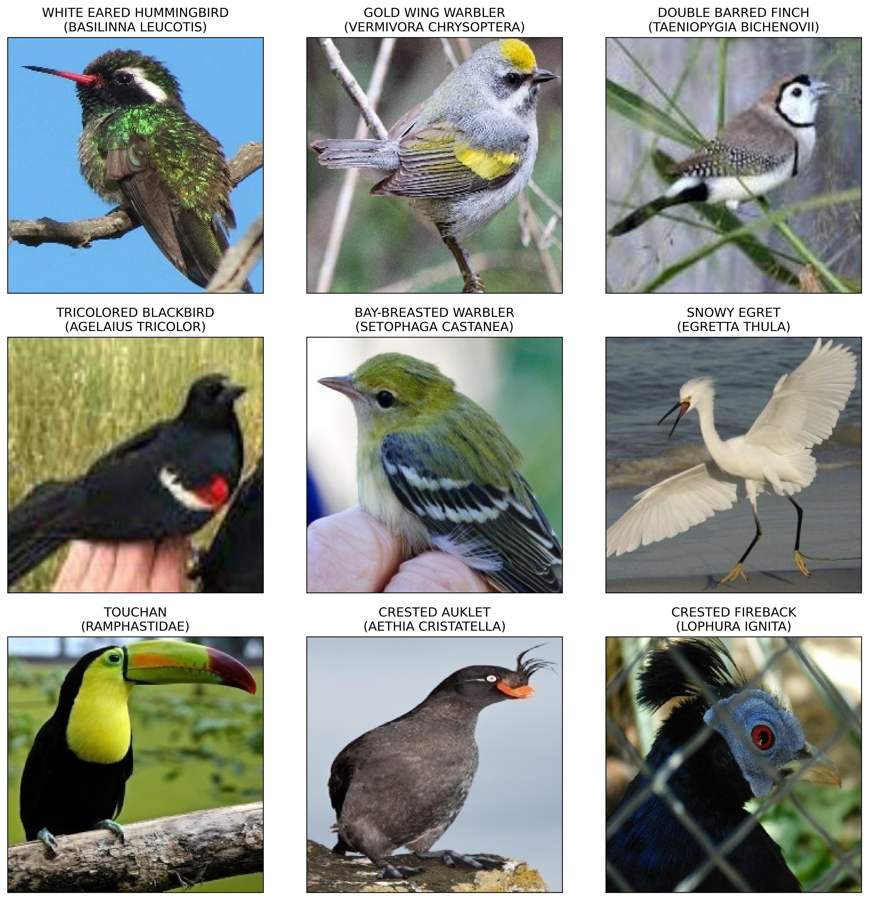
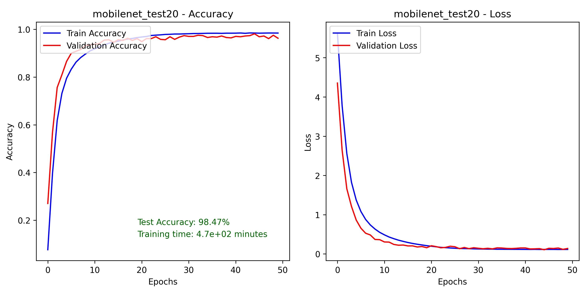
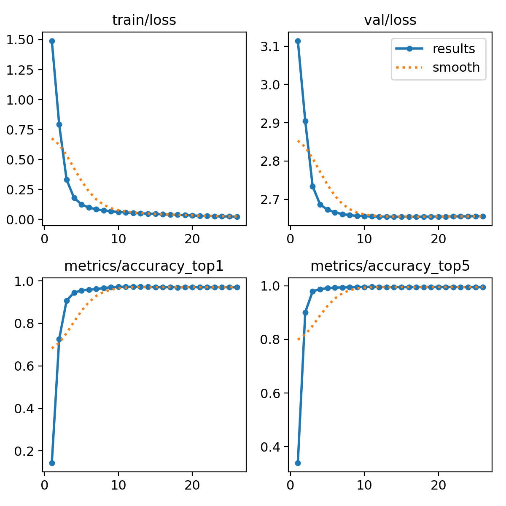

<details>
  <summary>Table of Contents</summary>
  <ol>
    <li>
      <a href="#introduction">Introduction</a>
    </li>
    <li><a href="#technical-tools">Technical Tools</a></li>
    <li><a href="#data-source">Data source</a></li>
    <li><a href="#the-design">The design</a></li>
    <li><a href="#results">Results</a></li>
    <li><a href="#how-to-use-the-source-code">How to use the source code</a></li>
    <li><a href="#the-bottom-line">The Bottom Line</a></li>
    <li><a href="#reference">Reference</a></li>
  </ol>
</details>

### Introduction

This repository offers source code for a bird classification model that can identify 524 species. It's designed for efficiently testing various model architectures, including:

-   InceptionV3;
-   MobileNetV1 and MobileNetV2;
-   YOLOv8.

After evaluating performance metrics and processing speed, MobileNetV1 was chosen as the most suitable model for this task.

### Technical tools

-   The orginal paper of Inception <a href="https://arxiv.org/pdf/1409.4842.pdf">(C. Szegedy et al., 2015)</a>.

-   The application documentation of <a href="https://www.tensorflow.org/api_docs/python/tf/keras/applications/inception_v3/InceptionV3"> InceptionV3 </a> using TensorFlow v2.14.0.

-   The orginal paper of MobileNet <a href="https://arxiv.org/pdf/1704.04861.pdf">(Howard, A.G. et al., 2017)</a>.

-   The application documentation of <a href="https://www.tensorflow.org/api_docs/python/tf/keras/applications/mobilenet/MobileNet"> MobileNet </a> using TensorFlow v2.14.0.

-   The orginal paper of You Only Look Once YOLO architecture <a href="https://arxiv.org/pdf/1506.02640.pdf">(Redmon, J. et al., 2016)</a>.

-   The application documentation of <a href="https://docs.ultralytics.com/"> YOLOv8 </a> by Ultralytics.

*   Pytorch
*   TensorFlow
*   numpy
*   pandas
*   Docker
*   AWS EC2
*   AWS S3

### Data source

This project utilizes a bird species dataset provided by <a href="https://www.kaggle.com/gpiosenka">Gerry</a>, available on Kaggle. For detailed information, visit <a href="https://www.kaggle.com/datasets/gpiosenka/100-bird-species/data"> birds 525 species- image classification </a>.

### The design



The diagram provided above outlines the core structure of this project. The training of the model was carried out on AWS EC2, utilizing data stored in an S3 bucket. Following is the example of a brief outline of the code setups for experimenting with different configurations of MobileNetV1 and YOLOv8.

-   MobileNetV1 - test20 configuration

```python
# ________________ CONFIG THE BASE MODELS ________________ #
learning_rate = 0.001
epochs = 50
patience = 15
factor = 0.6

# _______ MOBILENET test20: RE-TRAIN ALL LAYERS WITH DATA AUGMENTATION _______ #
model_base = tf.keras.applications.mobilenet.MobileNet(
    include_top=False, weights="imagenet"
)
model_base.trainable = True
...

# add callbacks mechanism to the model fitting
callbacks = [
    ...
]

# refit model and record metrics
history = model_0.fit(
    train_data,
    epochs=epochs,
    steps_per_epoch=len(train_data),
    validation_data=val_data,
    validation_steps=int(0.25 * len(val_data)),
    verbose=1,
    callbacks=callbacks,
)
```

-   YOLOv8 - test1 configuration

```python
# custom configuration
epochs = 50
patience = 15
batch = 16
image_size = 224
device = 0
workers = 2
pretrained = False
optimizer = "auto"
verbose = True
lr0 = 0.01
weight_decay = 0.0005
dropout = 0.0

model = YOLOv8(
    test_name=test_name,
    model_yaml=model_yaml,
    model_pt=model_pt,
    data=data,
    project=project,
    ...
)

# _ TRAIN _ #
model.train()

# _ EVALUATING ON TEST DATA _ #
predictions, test_accuracy = make_evaluation_on_testdata(
    path_to_chosen_model, path_to_testdata, path_to_json
)
```

### Results

<h6 align="center">
  Visualization of bird species
</h6>

<p align="center">
  
</p>

This project involved numerous experiments, but only the most significant results are highlighted here.

<h6 align="center">
MobileNet - test 20
</h6>

<p align="center">
    
</p>

<h6 align="center">
YOLOv8 test0
</h6>

<p align="center">

</p>

-   YOLOv8 accuracy on test data: 98.5%

The results of this project is pretty decent when compared to similar efforts addressing the task of classifying bird species using the <a href="https://www.kaggle.com/datasets/gpiosenka/100-bird-species/data"> birds 525 species- image classification dataset </a>. The highest accuracy achieved so far is approximately 98% on the test dataset (e.g., <a href="https://thesai.org/Downloads/Volume14No7/Paper_102-Bird_Detection_and_Species_Classification.pdf"> Vo, H.-T., et al. 2023</a>)

### How to use the source code

##### Using the source code for development

-   Fork this repository (https://github.com/LeoUtas/bird_classification_research.git).
-   First thing first, before proceeding, ensure that you are in the root directory of the project.
-   Get the docker container ready:

    -   Run docker build (it might take a while for installing all the required dependencies to your local docker image).

    ```cmd
    docker build -t <name of the docker image> .
    ```

    -   Run a docker container in an interactive mode (once the docker image is built, you can run a docker container).

    ```cmd
    docker run -it -v "$(PWD):/app" <name of the docker image> /bin/bash
    ```

    -   Now, it should be running inside the interactive mode of the docker container to explore the code functionalities.
    -   When you're done, you can simply type "exit" to escape the development environment

    ```
    exit
    ```

-   Also, stop running the container when you're done:

    ```cmd
    docker stop <name of the container>
    ```

### The bottom line

I'm excited to share this repository! Please feel free to explore its functionalities. Thank you for this far. Have a wonderful day ahead!

Best,
Hoang Ng

### Reference

C. Szegedy et al., 2015. "Going deeper with convolutions," 2015 IEEE Conference on Computer Vision and Pattern Recognition (CVPR), Boston, MA, USA, 2015, pp. 1-9, doi: 10.1109/CVPR.2015.7298594.

Howard, A.G. et al., 2017. MobileNets: Efficient Convolutional Neural Networks for Mobile Vision Applications. CoRR, abs/1704.04861. Available at: http://arxiv.org/abs/1704.04861.

Redmon, J. et al., 2016. You Only Look Once: Unified, Real-Time Object Detection. In 2016 IEEE Conference on Computer Vision and Pattern Recognition (CVPR). pp. 779–788.

Vo, H.-T., et al. (2023). "Bird Detection and Species Classification: Using YOLOv5 and Deep Transfer Learning Models." International Journal of Advanced Computer Science and Applications 14.
